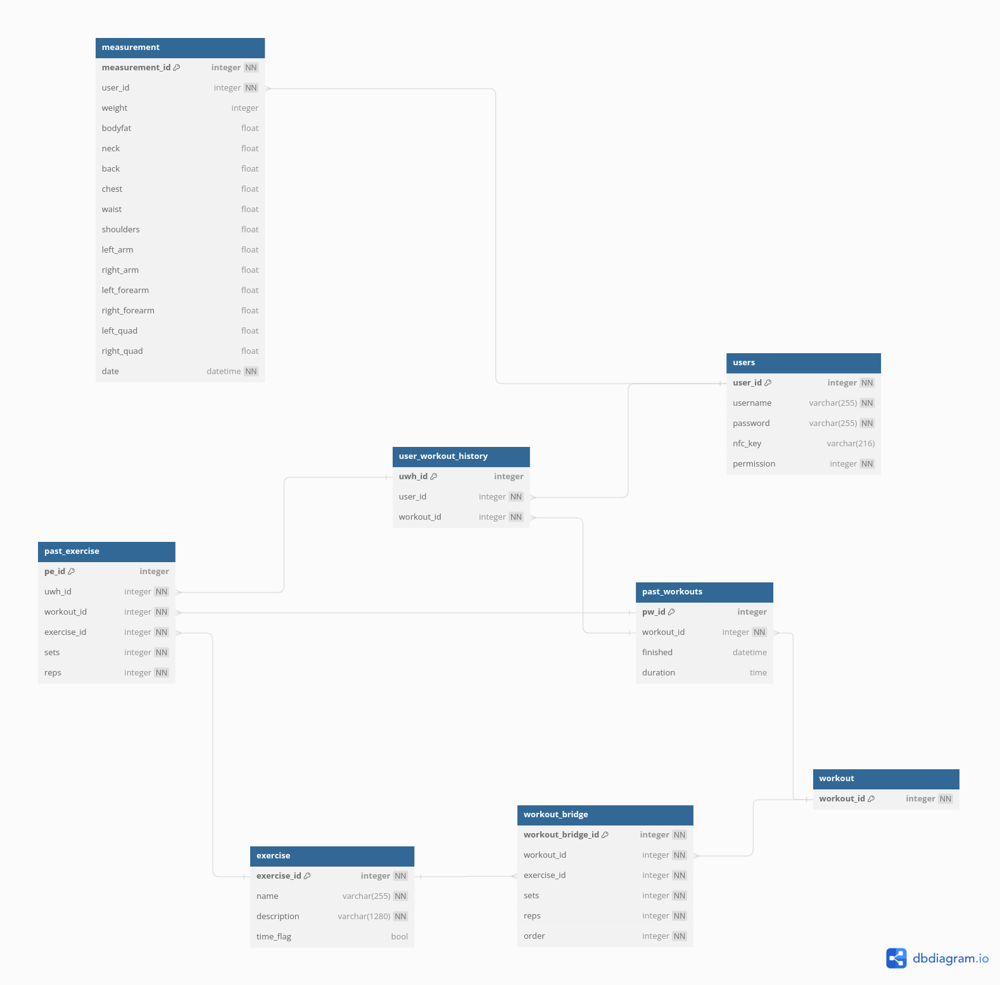

# Weightlifter 


```diff
- WARNING: This project is still in development and is not ready for production use.
```

## Introduction

Weightlifter as a whole, is a intergraded system that allows users to track their workouts and progress; the [Frontend](https://github.com/identityofsine/weightlifter) is a Electron Application that behaves similar to kiosk software. The Frontend will provide an interface for users to interact with the system. The expected system is a old, low-preforming computer that is connected to a off-brand touch screen display. This touch-screen display is mounted in the bottom-right corner of a large mirror. 

The backend is a RESTful API that handles the logic of the system, such as Database management, User Authentication, and Workout Tracking. The backend is built using Node.js and Express.js. The database is a simple MySQL database that is hosted in a Docker container.

The backend will also provide a private website that will allow the gym owner to manage the system and allow users to sign up for the system. The website will be built using React.js and will be hosted on the same server as the backend (only accessible through a private tunnel). 

## Installation


```diff
- WARNING: This project is still in development and is not ready for production use.
```

To install the backend, you will need to have Docker installed on your machine. Once you have Docker installed, you can run the following command to start the backend:

```bash
docker-compose build
docker-compose up
```

This will start the backend on port 3000, you can then access the API by going to `http://localhost:3000`.


### Link to Frontend

> TBD


## Database 

The database schema is defined in the `database.sql` file in this repository. For a abstract and detailed view of the schema, please refer to the screenshot below.



## API Endpoints

The API endpoints are defined in the `api_endpoints.md` file in this repository. For a detailed view of the endpoints, please refer to the screenshot below.


